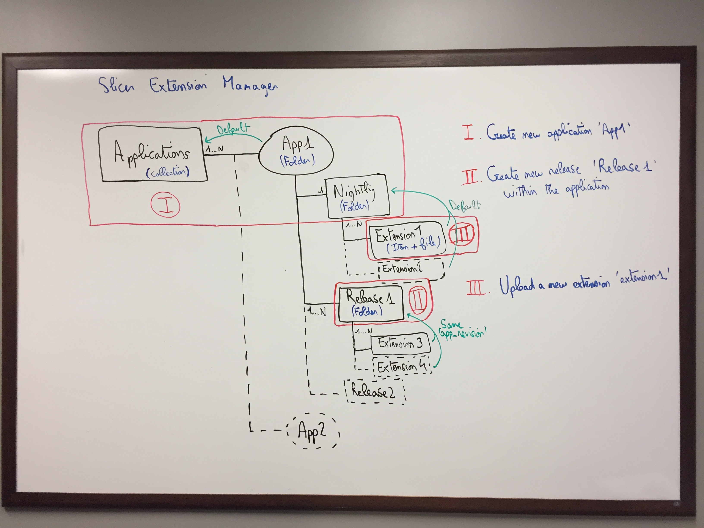

Slicer package manager |CircleCI| |Documentation|
===================================================

External plugin of Girder that allow the management of Slicer packages and extensions
(before handled by the data management platform Midas).

If you need to learn more about the Slicer Package Manager, the documentation is available at
http://slicer-package-manager.readthedocs.io/en/latest/.

And to have a better idea of how works the Slicer package manager plugin within Girder, here is a diagram:

.. |CircleCI| image:: https://circleci.com/gh/girder/slicer_package_manager.svg?style=svg
    :target: https://circleci.com/gh/girder/slicer_package_manager
    :alt: Build Status

.. |Documentation| image:: https://readthedocs.org/projects/slicer-package-manager/badge/?version=latest
    :target: http://slicer-package-manager.readthedocs.io/en/latest/?badge=latest
    :alt: Documentation Status
